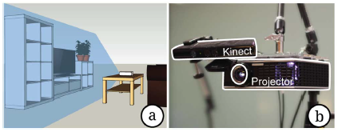

#In Search of Learning: Facilitating Data Analysis in Educational Games
##作者
__Erik Harpstead__  
__Brad A.Myers__  
__Vincent Aleven__  
>人机交互研究所  
>Hunman-Computer Interaction Institute  
>卡内基梅隆大学  
>Carnegie Mellon University  
>匹兹堡，宾夕法尼亚州  
>Pittsburgh, PA
##摘要
教育游戏领域已经出现了许多要求增加严谨性的呼声。提高该领域严谨性的方法之一是开发一种更普遍的测量学生在游戏中学习的方法。在开发的过程中，与测量和评估相关的可能会影响游戏的最终产品。该领域需要一种方法，开发人员和研究人员能够采用不同的方法对原型进行试验，同时能够提供新的发展方向。我们展示了一个工具包和分析工具，能够捕捉并分析学生在开源教育游戏中的表现。该系统记录了游戏过程中的相关事件，可用于设计者分析玩家学习的分析。该工具支持重放玩家在原始游戏环境中的会话，这使得研究者和开发者能够探索学生表现的解释。使用该系统，我们能够帮助分析学生在教育游戏学习，在不断迭代的过程中更加深入地了解学生的学习与游戏。
##相关工作
本论文实验中涉及到的游戏RumbleBlocks可在[ENGAGE] (http://www.etc.cmu.edu/engage/)找到，出自卡耐基梅隆大学的一个娱乐技术中心，其还发布了其他几款教育游戏。  
__贡献__  
* 提出了一个记录分析学生在玩游戏时表现的方法，使用重新创建游戏状态以方便分析玩家在游戏中的学习。这种方法既可以在迭代开发的过程中作为形成分析，也可以在游戏部署后评估学生的学习。
* 
##在周边显示
__装置__  
